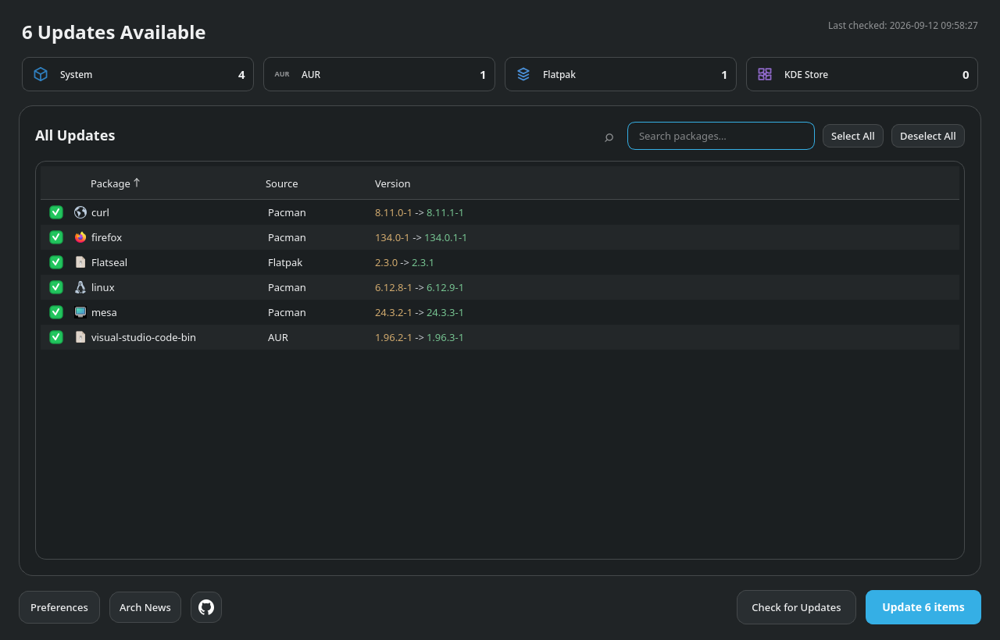
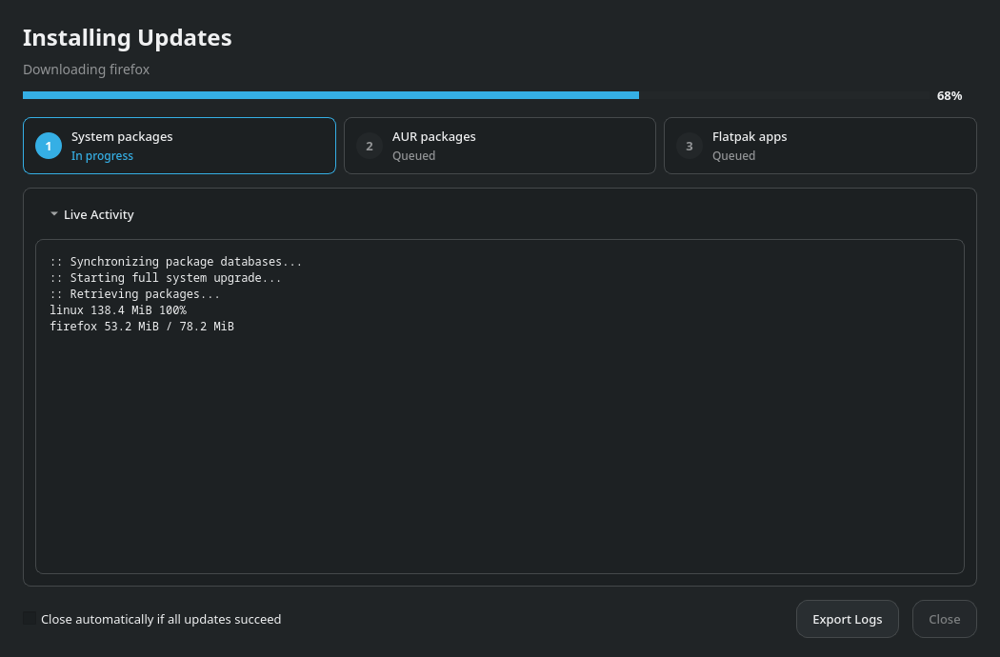
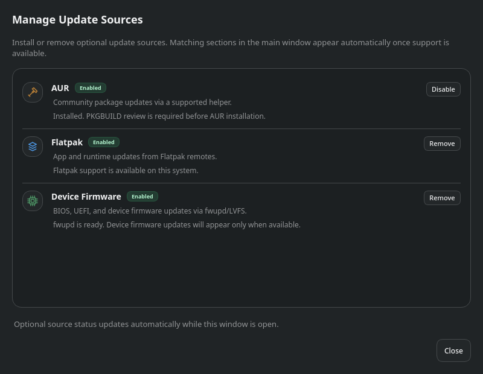
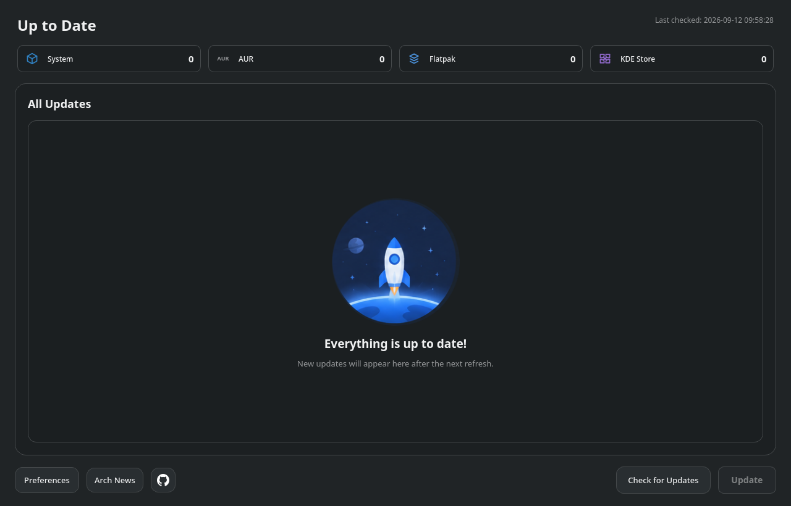

# ArchUpdater

**A simple, direct way to keep your Arch desktop up to date.**

[](https://github.com/Darayavaush-84/ArchUpdater/releases/latest)
[](https://github.com/Darayavaush-84/ArchUpdater/actions/workflows/ci.yml)
[](LICENSE)

ArchUpdater brings system packages, AUR, Flatpak, firmware and Plasma add-ons into one
Python/PySide6 desktop application. Open it, see what needs attention, review the changes
and update. The interface keeps the next action clear, while details and logs stay within reach.



## Why ArchUpdater?

Routine maintenance should be easy to understand. ArchUpdater focuses on the short path
from **“Are there updates?”** to **“What changed?”**.

Its distinction is its scope: it concentrates on updating the software already on your
system. The main screen puts available updates, versions and the actions you need together,
without turning everyday maintenance into a tour through a full software catalog.

- **Simple to read.** A clear package list, source counters and searchable updates.
- **Direct to use.** Check, review and update from the same window.
- **Relevant to your desktop.** Optional sources appear when their support is available
  and active. AUR support requires an explicit opt-in.
- **Details when you need them.** Package information, Arch Linux news, prompts and live
  logs are accessible from the update workflow.
- **A clear finish.** Results remain visible after an update; automatic closing is off by default.

The goal is simplicity and immediacy, with the underlying package tools still doing their jobs.

## The everyday workflow

1. **Check for Updates.** The app also checks at startup when the network is available.
2. **Review the list.** Filter by source, inspect versions and open package details or Arch News.
3. **Choose optional updates.** System packages always use a full Pacman transaction.
4. **Update.** Follow progress and answer any required prompts in the app.
5. **Review the result.** See what completed, what needs attention and whether a restart is advised.



## Update sources

| Source | What ArchUpdater does |
| --- | --- |
| **System packages** | Checks and updates packages using Pacman. System updates remain a full transaction. |
| **AUR** | Detects a supported helper (`paru`, `yay` or `pikaur`). Disabled by default; enabling it requires confirmation. Builds require reviewing the AUR files first. |
| **Flatpak** | Handles both user and system installations and verifies the resulting installed versions. |
| **Firmware** | Uses `fwupd` and shows firmware updates when available. |
| **Plasma add-ons** | Checks supported KDE Store add-ons and provides Plasma restart guidance where needed. |

Manage optional support from **Preferences → Manage Update Sources**. ArchUpdater can
install or remove supported optional-source packages there. AUR helpers must be installed manually.



## Quiet when everything is current

The system tray provides an animated busy icon, an update count and status indicators.
Automatic checks and background notifications are configurable. The GitHub button shows a
small green **Update** label when it detects a newer stable ArchUpdater release; clicking it
opens the release page. It does not install an ArchUpdater release automatically.



*Screenshots are captured from the actual 1.0.0 interface with demonstration package and
progress data. They illustrate the workflow, not the current versions available in repositories.
Appearance also depends on your Qt theme and display scaling.*

## Install

ArchUpdater targets **Arch Linux and Arch-based distributions**, with Python **3.12+**.
It uses PySide6 and the system's package tools. KDE Plasma is needed for Plasma-specific features.

[Download the project ZIP](https://github.com/Darayavaush-84/ArchUpdater/archive/refs/heads/main.zip),
extract it, and open a terminal in the extracted folder:

```bash
sudo ./install.sh
```

The installer detects and installs missing system dependencies (`git`, `python`,
`pacman-contrib`, `fakeroot`, `polkit`, and `qt6-svg`). If any are missing, it runs
`pacman -Syu --needed` and asks you to review the transaction, including system updates.
If all are installed, this step is skipped. Python dependencies are installed automatically.

If you already have Git, you can also clone the project:

```bash
git clone https://github.com/Darayavaush-84/ArchUpdater.git
cd ArchUpdater
sudo ./install.sh
```

Launch **ArchUpdater** from your application menu, or run `archupdater`.
The GUI runs as your normal user; privileged operations request authorization when needed.

The installer creates a versioned Python environment under `/opt/archupdater/releases`,
adds the launcher and integrates the privileged helper and Polkit policy. It switches
`/opt/archupdater/current` only after checking the staged installation.

To install a newer checked-out version, run `sudo ./install.sh` again.

### Uninstall

Keep your per-user settings and logs:

```bash
sudo archupdater-uninstall
```

Or remove the invoking user's ArchUpdater settings, logs, caches and autostart configuration too:

```bash
sudo archupdater-uninstall --purge-user-data
```

## Decisions stay visible

ArchUpdater keeps the familiar Arch maintenance rules in its workflow:

- Pacman updates remain full system transactions.
- Package conflicts and replacements that need a decision are presented in the GUI.
- AUR build files must be reviewed before building; builds run as the unprivileged user.
- Changed Pacman and system Flatpak update plans require confirmation again.
- If Arch Linux news cannot be checked, proceeding requires an explicit override.
- Some firmware and Plasma changes require a reboot or session restart.

Read the details before approving a change, especially for AUR builds and system upgrades.

## Development

Use a virtual environment for development:

```bash
python3 -m venv .venv
source .venv/bin/activate
python -m pip install -c constraints-ci.txt -e '.[dev]'
python -m archupdater
```

Source-only development does not install the system helper; use the system installer when
validating privileged update flows.

```bash
ruff check src tests scripts
python -m vulture src tests --min-confidence 80
QT_QPA_PLATFORM=offscreen python -m unittest discover -s tests
scripts/check_translations.sh
scripts/build_distribution.sh
```

See [the architecture guide](docs/architecture.md) for module boundaries.
Translation validation checks the existing catalogs without rewriting them.

## Feedback and contributions

[Report an issue](https://github.com/Darayavaush-84/ArchUpdater/issues) with the steps to
reproduce it, the update source involved and relevant logs. Remove personal information
from logs before sharing them. Contributions that make routine updates clearer and easier
to follow are welcome.

## License

ArchUpdater is licensed under **GPL-3.0-or-later**. See [LICENSE](LICENSE).
The GitHub logo is a trademark of GitHub, Inc.; its asset notice is included in the project.
